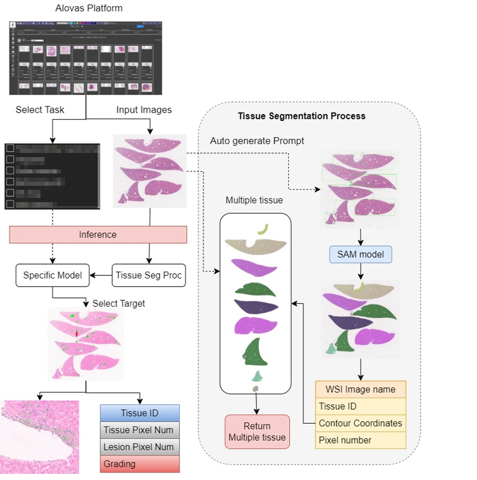
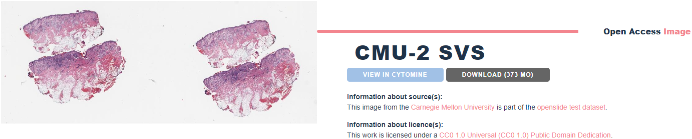
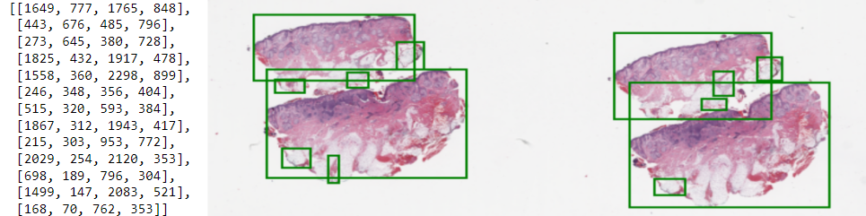
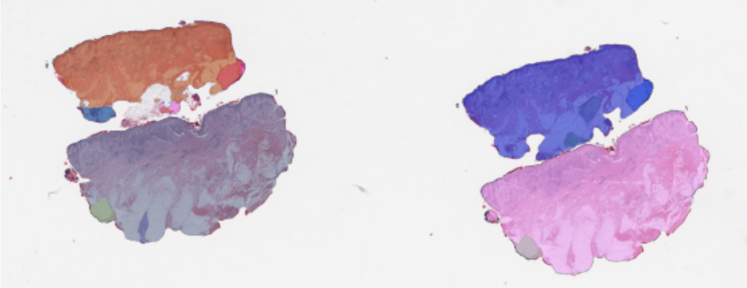

# Segment-Anything-Model-Applied-to-Alovas-platform

* Automatically generated prompt which is used to guide the ["Segment Anything Model"](https://github.com/facebookresearch/segment-anything) to segment the target area.

* Structure of the "Segment Anything Model" applied to [Alovas platform](https://www.alovas.com/).

## Dependencies
* Pytorch-21.08-py3:latest
* Download the meta segment_anything weight:
    ```shell
        mkdir weights
        cd weights
        wget -q https://dl.fbaipublicfiles.com/segment_anything/sam_vit_h_4b8939.pth
    ```
* Install others related library and dependencies:
   ```shell
       cd segment-anything; pip install -e .
       pip install opencv-python pycocotools matplotlib onnxruntime onnx
       sudo apt-get update
       sudo apt-get install ffmpeg libsm6 libxext6  -y
       sudo apt-get install -y libvips
   ```
## Codes
* Because the medical images we used have a data privacy problem, so here I used the [Carnegie Mellon University part of the openslide test dataset](https://cytomine.com/collection/cmu-2/cmu-2-svs) for example.

### contour_prompt.py
* The original medical image from the hospital, the image format may include .svs .mrxs .tiff. So I use "Openslide" to help me read and process the pathology images.
* I use "Opencv" to help me find the contour of the tissues inside the whole slide image, and generate their specific bounding box coordinates.
* The bounding box coordinates are the prompt.

```shell
    python contour_prompt.py
```

### sam_results.ipynb
* This code uses the prompt generated from the contour_prompt.py code and inputs them into the segment anything model to guide the tissue segmentation area.
```shell
    python sam_results.ipynb
```

### alovas_sam.py
* This code is only for the Alovas platform.

## Conclusion
In the past, training models were often trained for a single task. I am very interested in this kind of model that can be used in various fields, and I am currently continuing to study it.
